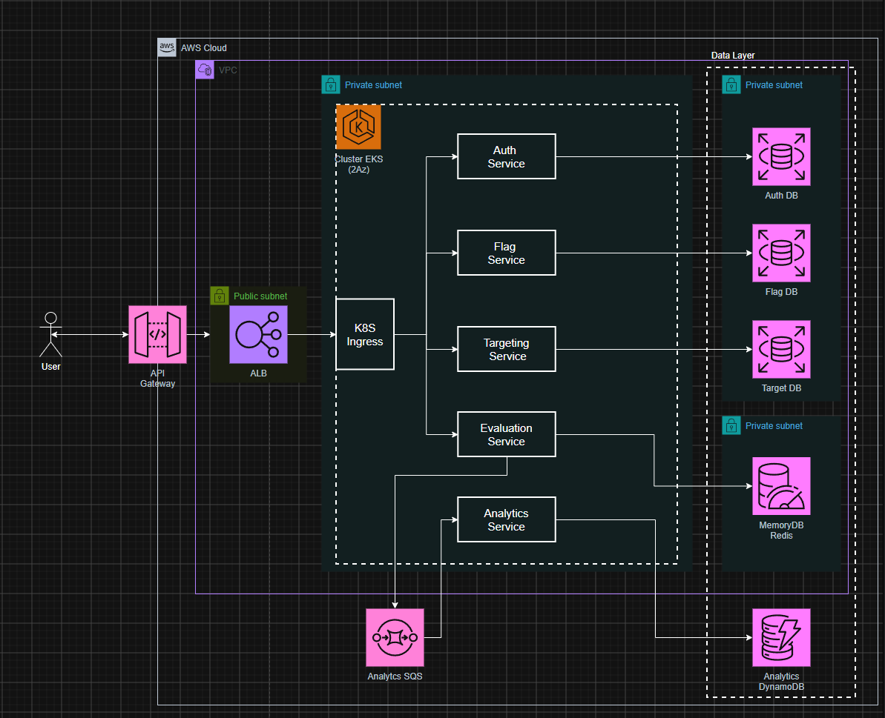

# ToggleMaster

O ToggleMaster é uma aplicação baseada em microsserviços para gerenciamento e avaliação de feature flags. A solução contempla autenticação, cadastro de flags, definição de regras de segmentação, avaliação em tempo real e processamento assíncrono de eventos para analytics.

## 📌 Visão geral

O projeto foi dividido em cinco serviços, cada um com uma responsabilidade bem definida:

- `auth-service`: autenticação e geração/validação de chaves de API.
- `flag-service`: cadastro e consulta de feature flags.
- `targeting-service`: definição das regras de segmentação por flag.
- `evaluation-service`: avaliação das flags consumidas pelos clientes.
- `analytics-service`: consumo assíncrono dos eventos enviados pelo `evaluation-service`.

Cada serviço possui seu próprio `Dockerfile`, respeitando as diferenças de stack, dependências e requisitos de execução.

## 🧱 Arquitetura

Fluxo principal:

1. O cliente autentica e consome os endpoints expostos pelos serviços.
2. O `auth-service` valida a autenticação e emite a chave necessária para acesso aos demais serviços.
3. O `flag-service` mantém o cadastro das feature flags.
4. O `targeting-service` armazena as regras de segmentação associadas às flags.
5. O `evaluation-service` consulta o cache e os serviços internos para decidir o resultado da flag.
6. O `analytics-service` consome os eventos publicados na fila e grava os dados no DynamoDB.

### 🗺️ Desenho da arquitetura

### ☁️ Provisionamento de recursos

Além dos serviços da aplicação, foi necessário provisionar recursos na AWS para persistência, cache e comunicação assíncrona:

- `RDS`: três bases relacionais PostgreSQL, utilizadas para persistência dos dados transacionais da aplicação.
- `ElastiCache Redis`: cache em memória utilizado para otimizar o tempo de resposta na avaliação das flags.
- `DynamoDB`: banco não relacional utilizado para armazenar dados analíticos sem a necessidade de uma estrutura relacional rígida.
- `SQS`: fila Standard utilizada para publicar eventos que são consumidos de forma assíncrona.

#### Diferença entre os tipos de armazenamento

Cada serviço possui uma necessidade específica de armazenamento. Para os serviços responsáveis pelo controle dos dados transacionais da aplicação (`auth-service`, `flag-service` e `targeting-service`), foi utilizado PostgreSQL, pois o modelo relacional oferece maior integridade e consistência.

No `evaluation-service`, a prioridade é o tempo de resposta. Por isso, foi utilizado Redis como cache em memória, reduzindo a necessidade de consultas repetidas aos serviços internos. Já o `analytics-service` utiliza DynamoDB, uma opção adequada para armazenar eventos analíticos que não exigem uma estrutura relacional rígida.

## 🧪 Teste local

O ambiente local foi montado com `docker-compose.yml`, responsável por provisionar os recursos necessários e construir os containers com base no `Dockerfile` de cada serviço.

### O que sobe localmente

- Bancos PostgreSQL para `auth-service`, `flag-service` e `targeting-service`.
- Redis para cache do `evaluation-service`.
- SQS local para fila de eventos.
- DynamoDB local para persistência dos eventos de analytics.

No ambiente local, também foi criado um arquivo `.env` para configurar a variável `SERVICE_API_KEY`, essencial para a comunicação autenticada entre os serviços.

## 🚀 Provisionamento no Kubernetes

A abordagem escolhida para este projeto foi utilizar um único cluster e um único namespace. Essa decisão considera o escopo do trabalho e evita a complexidade adicional que seria gerada pela separação de namespaces por microsserviço.

Mesmo com essa simplificação, o isolamento operacional necessário é mantido, pois cada microsserviço possui seus próprios manifestos de configuração e provisionamento. Dentro do namespace, os recursos continuam separados por nome:

- `auth-service`
- `flag-service`
- `targeting-service`
- `evaluation-service`
- `analytics-service`

Outra decisão tomada para simplificar a entrega foi a adoção de um monorepo. Assim, todos os serviços ficam no mesmo repositório Git, facilitando a apresentação e a navegação pelo projeto. Ainda assim, cada serviço mantém suas particularidades de implementação, dependências e execução.

### Orquestração e implantação com manifestos

O ponto central do desafio foi a construção dos manifestos Kubernetes, responsáveis por configurar e provisionar os recursos no cluster. Eles foram criados com base nas boas práticas do Kubernetes e na documentação oficial, buscando garantir uma implantação organizada e segura.

Alguns manifestos são comuns a todo o cluster, enquanto outros são específicos de cada serviço. Todos os arquivos utilizados pela aplicação estão disponíveis na pasta [k8s](./k8s/).

## 📄 Manifestos Kubernetes

- **Namespace**: cria o namespace onde todos os recursos da aplicação são provisionados, evitando conflito de nomes com outros recursos do cluster.
- **ConfigMap**: armazena configurações que podem ser alteradas sem a necessidade de reconstruir a imagem do container.
- **Secret**: armazena informações sensíveis, como senhas e chaves de API. Os valores são declarados em Base64. Para fins de demonstração, os manifestos de secrets foram versionados no repositório; em um ambiente de produção, eles não devem ser mantidos dessa forma.
- **Deployment**: gerencia a criação, atualização e disponibilidade dos pods de cada serviço.
- **Job**: executa tarefas pontuais ou recorrentes. Neste projeto, foi utilizado para criar as tabelas necessárias nos bancos relacionais usados por `auth-service`, `flag-service` e `targeting-service`.
- **Service**: expõe os pods internamente no cluster e direciona o tráfego para as instâncias corretas.
- **Ingress**: gerencia o acesso externo aos serviços. Neste projeto, foi utilizado para criar um endpoint único e aplicar as regras de roteamento para os diferentes serviços.
- **HorizontalPodAutoscaler**: ajusta automaticamente a quantidade de réplicas dos serviços de acordo com o uso de CPU, contribuindo para a escalabilidade da aplicação.

## ⚠️ Desafios encontrados

Durante o desenvolvimento do projeto, foram enfrentados desafios tanto na implementação dos serviços quanto no provisionamento da infraestrutura.

### Desafios em código

Durante a construção dos `Dockerfile` e do `docker-compose.yml`, foram identificadas incompatibilidades de dependências nos projetos. Nos serviços em Go, havia divergências entre algumas versões utilizadas. Nos projetos em Python, também foram encontradas incompatibilidades entre bibliotecas.

Outro problema observado nos serviços Python foi a falha da biblioteca `psycopg2-binary`, utilizada na integração com PostgreSQL, ao executar em imagens Alpine. Para contornar esse cenário, foi instalada uma versão de desenvolvimento do PostgreSQL (`postgresql-dev`) no ambiente de teste.

Também ocorreram problemas ao instanciar o PostgreSQL localmente por falta de configurações corretas do banco. A correção foi realizada recriando o banco com os parâmetros adequados. Já no DynamoDB local, houve falha ao iniciar o banco com SQLite, o que exigiu ajustar o build para utilizar a opção `-inMemory`.

Quando a aplicação foi executada, os serviços funcionaram corretamente até a chamada ao `evaluation-service`, que retornava um erro genérico. Após análise, foi identificada a falta de uma API key interna, já documentada no [README do evaluation-service](/evaluation-service/README.md). Para resolver o problema, foi feita uma pequena alteração no [docker-compose.yml](/docker-compose.yml), permitindo que essa configuração fosse carregada a partir de um arquivo `.env` na raiz do projeto. Dessa forma, a chave pode ser alterada com mais facilidade quando necessário.

### Desafios na cloud

Para o desenvolvimento do trabalho, optou-se pelo uso da conta do AWS Academy, o que gerou alguns contratempos:

- O provisionamento dos recursos precisava ser feito na mesma conta, sem possibilidade de criação de outros usuários, o que gerou alguns conflitos de acesso.
- A utilização de uma única role, `LabRole`, limitou a simulação de alguns cenários e impediu o provisionamento dos recursos via CLI ou IaC, aumentando o tempo necessário para a configuração.

Em relação ao provisionamento da infraestrutura, também foram encontradas algumas situações específicas:

- Para agilizar a criação do cluster, a primeira tentativa foi utilizar os nodes na VPC padrão da conta. Essa abordagem não funcionou, pois as instâncias EC2 não conseguiram ser vinculadas aos nós do cluster.
- Com todos os recursos já provisionados, os testes da aplicação indicaram erros de leitura e escrita no Redis pelo `evaluation-service`. Após a análise, foi identificado que o cluster Redis não havia sido incluído no Security Group correto.
- Durante os health checks dos serviços, foi constatado que diversas rotas entravam em colisão por exporem o mesmo path `/health`. Para evitar esse conflito, o manifesto de [Ingress](./k8s/ingress.yaml) foi ajustado para distribuir melhor as rotas, utilizando caminhos como `/auth/health` e `/flag/health`.

### Uso de IA

Neste projeto, a IA foi utilizada como apoio em situações nas quais o grupo precisou acelerar a análise ou encontrar caminhos para correção, por exemplo:

- Após a identificação de erros de dependência, a IA ajudou a analisar o projeto e entender como aplicar as correções.
- Em pontos nos quais algum recurso de infraestrutura havia sido esquecido, como a subnet privada para o Redis, a IA ajudou a analisar o erro e indicar a causa provável.
- A IA também foi utilizada para melhorar a estrutura da documentação, deixando o conteúdo mais claro, objetivo e agradável para leitura.

## 👥 Autores

| Nome | RM | Discord | E-mail |
| --- | --- | --- | --- |
| Allison Martins Orsini | rm375470 | Alisson Martins Orsini - rm375470 | alisson_mo@hotmail.com |
| Diogo Soares da Silva |  |  |  |
| Eduardo Garcia Barbara | rm374946 | Eduardo Garcia - rm374946 | eg47202@gmail.com |
| Eduardo Luiz Fonseca |  |  |  |

## 🏅 Link do certificado do Google Skills

[Google Skills](https://www.skills.google/public_profiles/4f177b68-0d79-4fde-b512-587be7c62bed)
